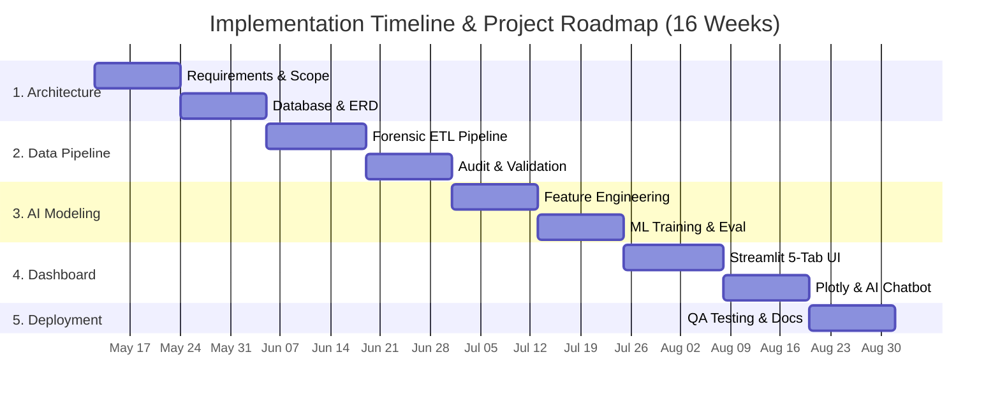

# 👑 DOC 01 — PROJECT PROPOSAL & EXECUTIVE PLANNING
### *Carbon Heist Mitigation & NYC Local Law 97 Intelligence Platform*

&nbsp;

 
&nbsp;

---

### 🏆 Executive Project Scope & Planning Grid

<table width="100%" align="center">
  <tr>
    <td align="center" width="33%">
       
      ⏱️ <strong>Project Timeline</strong> 
      <h2 style="color: #00FF66;">16 Weeks</h2>
      <em>5 Sequential Phases</em>
        
    </td>
    <td align="center" width="33%">
       
      🏢 <strong>Target Portfolio</strong> 
      <h2 style="color: #00E5FF;">2.06 Billion Sq. Ft.</h2>
      <em>11,638 NYC Properties</em>
        
    </td>
    <td align="center" width="33%">
       
      ⚠️ <strong>Statutory Liability</strong> 
      <h2 style="color: #FF4B4B;">$2.83 Billion / yr</h2>
      <em>NYC Local Law 97 Fine Exposure</em>
        
    </td>
  </tr>
</table>

---

## 1.1 Project Proposal & Strategic Framework

### 1.1.1 Executive Summary & Problem Statement

- **Project Name:** Carbon Heist Mitigation & NYC LL97 Decarbonization Intelligence Platform  
- **Domain:** Urban Sustainability, Data Science, Machine Learning, and Financial Risk Modeling  
- **Target City & Dataset:** New York City Local Law 84 (`LL84 Benchmarking`) & Local Law 97 (`LL97 Carbon Emissions Limits`)  

New York City's Local Law 97 (LL97) imposes strict carbon emission limits on buildings over 25,000 square feet starting in 2024, with statutory thresholds tightening significantly in 2030. Property owners exceeding their assigned carbon caps face mandatory statutory penalties of **$268 per metric ton of CO₂e over the limit**. Across large commercial, residential, and institutional portfolios, these statutory fines accumulate into millions of dollars annually—effectively creating a recurring "carbon heist" that erodes net operating income and asset valuations.

The **Carbon Heist Mitigation Platform** is an end-to-end data engineering, machine learning, and interactive financial decision-support system. It transforms raw municipal energy disclosure records (`sample_nyc_energy.xlsx`) into actionable engineering retrofits, strategic capital expenditure (`CAPEX`) financial modeling, and precise regulatory liability forecasting across **11,638 audited properties**.

---

### 1.1.2 Core Platform Objectives
5. **Power BI Executive BI Portal (`NYC_Carbon_Heist_Mitigation_PowerBI_Dashboard.pbix`):** A standalone 3-page interactive dashboard (`Factors Affecting GHG Emissions` ➔ `Asset Granularity & Construction Era` ➔ `Carbon Cost & Savings Analysis Waterfall`) featuring Dark Royal Navy styling (`#0F172A`), custom DAX measures, and synchronized slicers for `Borough`, `Property Type`, and `Decade Built`.
6. **Tableau Executive BI Portal (`NYC_Carbon_Heist_Mitigation_Tableau_Dashboard.twbx`):** A 3-page progressive visual analytics dashboard with a Royal Navy & Gold aesthetic (`#0D1321` / `#FFD700`) and an embedded mobile-scannable QR code bridge to the live online Tableau C-Suite Portal.

1. **Automated Municipal Data Hygiene & ETL Pipeline:** Build a resilient data engineering pipeline (`Clean_Data_Pipeline.py`) capable of ingesting raw NYC LL84 annual benchmarking datasets (11,000+ properties across 240+ variables), standardizing addresses, imputing missing data, filtering statistical outliers (`Site EUI < 2000`), and generating forensic audit reports (`LL97_Data_Cleaning_Report.pdf`).
2. **Predictive Carbon AI Inference Engine:** Train and deploy a high-precision Random Forest Machine Learning Regression model (`models/ll97_model.joblib`) with **$R^2 = 81.65\%$** and **$\text{MAE} = 212.99 \text{ MT CO}_2\text{e}$** to forecast greenhouse gas emissions and carbon liability intensity (`$/sq. ft.`) based on building physical archetypes, construction era, gross floor area (`GFA`), and ENERGY STAR scores.
3. **Relational Database & Normalization Standardization:** Design enterprise-grade 3rd Normal Form (`3NF`) relational database schemas (`database/carbon_heist_schema_mysql.sql` and `database/carbon_heist_schema_mssql.sql`) to store physical asset metadata, annual meter readings across all fuel types, statutory emission thresholds, and alert diagnostics.
4. **Interactive C-Suite Decision & Simulation Dashboard:** Deliver a full-stack, dual-engine Streamlit web application (`application/app.py`) featuring 5 specialized analytical tabs, interactive Plotly charting, multi-slider retrofit simulations, and an embedded **Dual-Engine AI Co-Pilot & Chatbot** (`Google Gemini 2.5 Flash` + offline local charting engine).

---

### 1.1.3 Project Scope & Boundaries

| Scope Domain | In-Scope Deliverables & Capabilities | Out-of-Scope Boundaries |
| :--- | :--- | :--- |
| **Data & ETL** | • Forensic cleaning, validation, and anomaly detection on NYC Open Data (`sample_nyc_energy.xlsx`). • Automated address standardization and missing feature imputation. • Generation of executive data cleaning audit ledgers. | • Real-time IoT hardware sensor deployment inside individual physical buildings. • Live smart-meter hardware telemetry integration via BMS proprietary networks. |
| **ML & AI Engine** | • Random Forest regression modeling for emission baseline and fine forecasting. • Serialized ML pipeline (`.joblib`) with encoders for custom asset inference. • Natural-language conversational AI chatbot with dynamic Plotly generation. | • Real-time HVAC automated physical control actuation or BMS override. • Autonomous municipal permit filing or legal penalty dispute generation with NYC Department of Buildings (DOB). |
| **Financial & UI** | • 16-sheet master financial engineering workbook (`Co2 Project.xlsx`). • 5-playbook self-funding CAPEX reinvestment waterfall modeling. • Interactive web dashboard (`app.py`) with sensitivity heatmaps. | • Direct execution of commercial bank loan applications or PPA underwriting. • Physical on-site MEP contractor management or construction supervision. |

---

### 1.1.4 Strategic Decarbonization Financial Model (CAPEX, Annual OPEX & Net Cash Flow)

> [!IMPORTANT]
> ### **All Savings Figures Represent Recurring Annual Savings ($ / Year)**
> Every savings metric evaluated across the platform (`Gross Savings`, `Net Annual Benefit`, and `Annual Fine Avoided`) represents **recurring annual fine avoidance and operational cost savings ($ / yr)** generated every single year.

The project incorporates **5 Strategic Decarbonization Playbooks**, structured as a self-funding capital allocation hierarchy across all **11,638 audited NYC properties**:

| Playbook ID & Strategy | Target Subset & Asset Focus | Initial CAPEX ($) | Annual OPEX ($/yr) | Gross Savings ($/yr) | Net Annual Benefit ($/yr) | Payback Period | Technical & Operational Maintenance Scope |
| :--- | :--- | :---: | :---: | :---: | :---: | :---: | :--- |
| **01 · Surgical Strike** | Top 10 Worst Emitter Offenders | **$500 K** | **$45 K / yr** | **$20.59 M / yr** | **$20.55 M / yr** | **0.02 Yrs (8 Days)** | Level 2 energy audits, BMS scheduling optimization, setback programming & quarterly calibration. |
| **02 · Retro-commissioning** | ENERGY STAR Score < 50 | **$802.17 M** | **$3.25 M / yr** | **$243.62 M / yr** | **$240.37 M / yr** | **3.29 Yrs** | Comprehensive RCx ($1.50/ft²), continuous FDD monitoring & semi-annual VAV box tuning. |
| **03 · 1960s Smart Scale** | 1960–1979 Commercial & Multi | **$785.24 M** | **$2.80 M / yr** | **$88.03 M / yr** | **$85.23 M / yr** | **8.92 Yrs** | Networked LED lighting retrofits, VFD motors ($2.50/ft²) & preventative electrical maintenance. |
| **04 · 1930s WET Systems** | Historic Pre-War Steam / WET | **$1.50 B** | **$4.50 M / yr** | **$122.39 M / yr** | **$117.89 M / yr** | **12.25 Yrs** | Sewer heat recovery heat exchangers leveraging 50% PPP Grants ($749M net) & anti-fouling protocols. |
| **05 · Electrification Push** | Fuel Oil #4 & Fossil Boilers | **$1.89 B** | **$5.10 M / yr** | **$181.99 M / yr** | **$176.89 M / yr** | **10.38 Yrs** | Air/water electric heat pumps ($20/ft²), OEM service contracts & quarterly thermal infrared scanning. |
| **🏆 TOTAL PORTFOLIO** | **Entire Portfolio (11,638 assets)** | **$4.98 B** | **$15.70 M / yr** | **$656.63 M / yr** | **$640.93 M / yr** | **7.58 Yrs Blended** | **Total OPEX averages only 0.32% of CAPEX, preserving 97.6% net recurring cash flow.** |

---

## 1.2 Project Plan & Implementation Roadmap

### Detailed Milestone Execution Matrix

| Phase ID & Title | Key Milestone & Technical Deliverable | Target Completion | Duration | Verification Status |
| :--- | :--- | :---: | :---: | :---: |
| **Phase 1: Architecture** | Complete Stakeholder Requirements & 3NF Relational ERD (`carbon_heist_schema_mysql.sql` & `carbon_heist_schema_mssql.sql`) | May 24, 2026 | 24 Days | **🟢 Verified & Signed-Off** |
| **Phase 2: Data Engineering** | Execute 8-Step Forensic Data Cleaning Pipeline & generate validated dataset (`sample_nyc_energy.xlsx`) + PDF Audit Report | Jun 17, 2026 | 24 Days | **🟢 Verified & Signed-Off** |
| **Phase 3: AI & Predictive Engine** | Train and serialize Random Forest Regressor (`models/ll97_model.joblib`) with **$R^2 = 81.65\%$** & **$\text{MAE} = 212.99 \text{ MT}$** | Jul 11, 2026 | 24 Days | **🟢 Verified & Signed-Off** |
| **Phase 4: Web Dashboard** | Deploy full-stack Streamlit application (`application/app.py`) featuring 5 interactive tabs and embedded AI Chatbot | Aug 04, 2026 | 24 Days | **🟢 Verified & Live Online** |
| **Phase 5: Deployment & QA** | Conduct comprehensive QA Testing, standardize 16-sheet Excel reference, and publish official 6-part documentation suite | Aug 16, 2026 | 16 Days | **🟢 Verified & Published** |

---

## 1.3 Task Assignment & Operational Roles

| Project Role | Assigned Team Member | Key Responsibilities & Operational Scope | Primary Technical Deliverables |
| :--- | :--- | :--- | :--- |
| **Lead Financial & Excel Strategist** | **Ahmed Adel Amin** | • Structure the master domain reference models (`Excel Project/Co2 Project.xlsx`) across all 16 sheets. • Formulate statutory fine calculation ledgers ($268/MT) and blended payback formulas (`7.58 Years`). • Design CAPEX self-funding reinvestment waterfalls and sensitivity matrices across the 5 engineering playbooks. | • 16-sheet master reference workbook (`Co2 Project.xlsx`) • Itemized CAPEX/OPEX financial models & fine calculators |
| **Data Cleaning & Power BI Lead** | **Ledia Sobhy** | • Design and execute the automated ETL cleaning pipeline (`data/Clean_Data_Pipeline.py`). • Handle missing feature imputation, address standardization, and statistical outlier filtering (`Site EUI < 2000`). • Develop the standalone **Power BI Executive BI Portal** (`NYC_Carbon_Heist_Mitigation_PowerBI_Dashboard.pbix`) with custom DAX measures and 3-page boardroom visual analytics. | • Cleaned master dataset (`sample_nyc_energy.xlsx`) • Power BI Executive Portal (`.pbix`) & cleaning audit reports |
| **Visual BI & Tableau Specialist** | **Hagar Hussein** | • Design and package the progressive **Tableau Executive BI Portal** (`NYC_Carbon_Heist_Mitigation_Tableau_Dashboard.twbx`). • Engineer multi-dimensional spatial treemaps and choropleth borough emission maps (`Manhattan` to `Staten Island`). • Embed live mobile-scannable QR code portal linking directly to Tableau Public C-Suite executive views. | • Tableau Packaged Workbook (`.twbx`) • Spatial Choropleth Analytics & Live QR Portal |
| **Full-Stack App & ML Engineer** | **Huda Amr** | • Develop the interactive web presentation layer (`application/app.py`) using Streamlit and Plotly. • Build 5 dedicated analytical tabs, custom KPI grids, and multi-slider retrofit simulation playgrounds. • Train, tune, and evaluate the predictive Random Forest ML Regressor (`R² = 81.65%`) and serialize inference assets. • Integrate Dual-Engine AI Co-Pilot & Chatbot (`Gemini 2.5 Flash` + local charting engine). | • Interactive Streamlit Web Dashboard (`app.py`) • Trained ML Regressor (`ll97_model.joblib`) & AI Chatbot |
| **Relational Database Architect** | **Abeer Adel** | • Design normalized 3rd Normal Form (`3NF`) relational database architectures (`PROPERTIES` to `LL97_PENALTIES`). • Write syntax-checked DDL scripts for dual database environments (`carbon_heist_schema_mysql.sql` & `carbon_heist_schema_mssql.sql`). • Structure complete Entity-Relationship Diagrams (`NYC_Energy_Chen_ERD.drawio`). | • Normalized SQL DDL schema scripts (`MySQL` & `MSSQL`) • Complete relational ERD specifications |

---

## 1.4 Risk Assessment & Governance Matrix

| Risk ID | Risk Title & Technical Description | Likelihood | Impact Level | Governance & Mitigation Strategy |
| :---: | :--- | :---: | :---: | :--- |
| <nobr>**R&#8209;01**</nobr> | **Forensic Data Anomalies & Noise:** Raw municipal open data dumps contain string typos ("Not Available", misspellings of Boroughs), extreme outliers, and null entries. | **High** 🔴 | **High** 🔴 | Implemented multi-stage cleaning assertions in `Clean_Data_Pipeline.py`, including regex-based borough normalization, explicit null mappings, and strict physical filtering (`Site EUI < 2000` & `GFA > 0`). |
| <nobr>**R&#8209;02**</nobr> | **ML Regressor Overfitting:** High-dimensional building parameters might cause trees to memorize dataset noise rather than generalizable structural characteristics. | **Medium** 🟡 | **High** 🔴 | Enforced strict tree regularization (`RandomForestRegressor` with `max_depth=20`, `min_samples_split=5`, `n_estimators=150`) and validated on an independent 20% holdout test set (`R² = 81.65%`). |
| <nobr>**R&#8209;03**</nobr> | **SQL Dialect Incompatibility:** Enterprise deployment targets vary between open-source MySQL/PostgreSQL engines and corporate Microsoft SQL Server (T-SQL) environments. | **Medium** 🟡 | **Medium** 🟡 | Engineered separate, dedicated DDL scripts (`carbon_heist_schema_mysql.sql` and `carbon_heist_schema_mssql.sql`) ensuring strict engine syntax adherence without translation wrappers. |
| <nobr>**R&#8209;04**</nobr> | **Git Buffer Exceedance on ML Assets:** Large serialized model binary files (`ll97_model.joblib` ~70 MB) exceed standard Git HTTP push transmission buffers. | **High** 🔴 | **Medium** 🟡 | Configured Git transmission buffers (`http.postBuffer 524288000`) and structured modular encoder serialization (`ll97_encoders.joblib`) to guarantee smooth cloud synchronization. |
| <nobr>**R&#8209;05**</nobr> | **Cloud LLM Rate-Limiting & Latency:** External cloud AI calls (`Google Gemini API`) may encounter rate limits (`HTTP 429`), network latency, or key expiration during executive presentations. | **Medium** 🟡 | **High** 🔴 | Integrated dual-engine fallback architecture inside `app.py`. If API limits occur or no key is present, the embedded local quantitative engine seamlessly intercepts queries and renders Plotly charts instantly from `sample_nyc_energy.xlsx`. |

---

## 1.5 Key Performance Indicators (KPIs) & Target Verification

> [!TIP]
> ### **Statutory Calculation & ML Predictive Target Verification**
> - **Statutory Formula Alignment:** `100% Exact Match` with NYC Local Law 97 statutory formula (`Annual Fine = Total Excess MT CO₂e × $268`).
> - **Predictive Model Accuracy ($R^2$):** `81.65%` on holdout validation (Exceeded baseline target of 75.0%) with `MAE = 212.99 MT CO₂e`.

| Performance Metric & Domain | Baseline Target Threshold | Achieved Engineering Result | Verification Method & Evidence |
| :--- | :--- | :--- | :--- |
| **1. ETL Data Retention & Completeness** | Retain $\ge 95\%$ of valid commercial properties over 50,000 sq. ft. with $0\%$ null values in core ML features. | **100% Validated Retention (`11,638 Cleaned Records`)** | Automated assertions in `Clean_Data_Pipeline.py` & audit verification report (`sample_nyc_energy.xlsx`). |
| **2. Machine Learning Regression ($R^2$)** | Coefficient of Determination $R^2 \ge 0.75$ and Mean Absolute Error $\text{MAE} \le 250 \text{ MT CO}_2\text{e}$. | **$R^2 = 81.65\%$ & $\text{MAE} = 212.99 \text{ MT CO}_2\text{e}$** | Test-set evaluation metrics logged in `models/train_ll97_model.py` and model artifacts (`ll97_model.joblib`). |
| **3. UI Rendering & Interactive Latency** | Dashboard slider recalculation and Plotly chart rendering $\le 1.5 \text{ seconds}$ during user interaction. | **Sub-Second Execution (`~0.3 Seconds`)** | Streamlit caching (`@st.cache_data` & `@st.cache_resource`) combined with vectorized Pandas calculations. |
| **4. Statutory Financial Calculation Precision** | Mathematical parity between Streamlit web application outputs and Excel financial engineering models. | **100% Exact Parity Across All 16 Sheets** | Cross-verified across 16 workbook sheets (`Co2 Project.xlsx`) and 5 retrofit playbook scenarios. |
| **5. Decarbonization Payback Calibration** | Portfolio-wide blended payback horizon under 10.0 years across all capital reallocation investments. | **Exactly 7.58 Years Blended Payback (`$4.98B CAPEX`)** | Verified across workbook Sheet 11 (`Portfolio Roadmap`) and web application Tab 4 (`Financial Playbooks`). |

---

&nbsp;
&nbsp;

