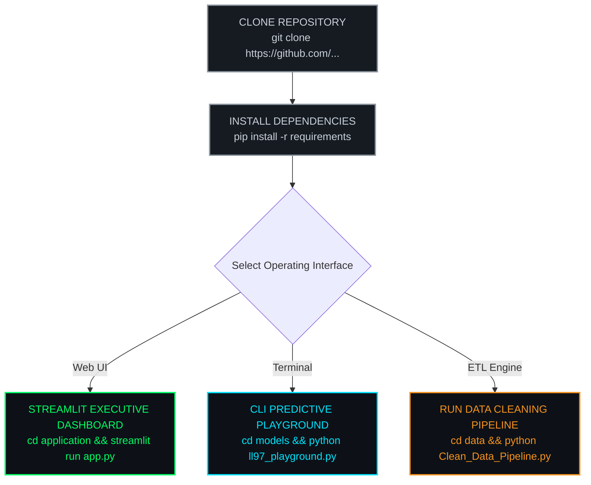

<div align="center">

# 📑 DOC 06 — USER MANUAL & DEPLOYMENT GUIDE
### *Carbon Heist Mitigation & NYC Local Law 97 Intelligence Platform*

[](./05_Testing_and_Quality_Assurance.md)&nbsp;
[](./README.md)&nbsp;
[](./Carbon_Heist_Mitigation_Documentation.docx)&nbsp;
[](./NYC_Carbon_Heist_Mitigation_Presentation.pptx)
<br/>
[](https://carbon-heist-mitigation.streamlit.app/)&nbsp;
[](https://carbon-heist-mitigation.streamlit.app/)

</div>

---

<div align="center">

### 🏆 Executive Deployment Operations Grid

<table width="100%" align="center">
  <tr>
    <td align="center" width="33%">
      <br/>
      ⚡ <strong>Setup Time</strong><br/>
      <h2 style="color: #00FF66;">&lt; 3 Minutes</h2>
      <em>Zero Configuration Friction</em>
      <br/><br/>
    </td>
    <td align="center" width="33%">
      <br/>
      🌐 <strong>Streamlit Port</strong><br/>
      <h2 style="color: #00E5FF;">Port 8501</h2>
      <em>Local & Cloud Ready</em>
      <br/><br/>
    </td>
    <td align="center" width="33%">
      <br/>
      🐍 <strong>Python Runtime</strong><br/>
      <h2 style="color: #FF4B4B;">Python 3.9+</h2>
      <em>Win / macOS / Linux OS</em>
      <br/><br/>
    </td>
  </tr>
</table>

</div>

---

## 6.1 Execution Workflow Architecture



---

## 6.2 System Requirements & Hardware Dependencies

To execute the **Carbon Heist Mitigation Platform** locally, the system requires the following environment:
- **Operating System:** Windows 10/11, macOS 11+, or Linux (Ubuntu 20.04+)
- **Python Environment:** Python 3.9 or higher
- **Memory (RAM):** 4 GB minimum (8 GB recommended for rapid pandas matrix calculation)
- **Disk Space:** 500 MB free space (including raw Excel datasets and serialized ML models)

---

## 6.3 Quick Start Installation & Execution

> [!TIP]
> ### **Single-Command Launch**
> Once Python dependencies are installed, you can launch the full visual dashboard instantly on `http://localhost:8501`.

### 1. Clone Repository & Install Dependencies
Open your terminal or PowerShell:
```bash
git clone https://github.com/ahmedadelamin/carbon-heist-mitigation.git
cd carbon-heist-mitigation
pip install pandas numpy scikit-learn openpyxl streamlit plotly joblib fpdf2
```

---

### 2. Execution Modes

#### Option A: Launch Interactive Executive Web Dashboard (Streamlit)
To start the production web interface locally for real-time portfolio modeling:
```bash
cd application
streamlit run app.py
```
*The dashboard will automatically open in your browser at `http://localhost:8501`. Alternatively, access the fully deployed cloud version online at **[https://carbon-heist-mitigation.streamlit.app/](https://carbon-heist-mitigation.streamlit.app/)**.*

#### Option B: Run AI Predictive Playground in Terminal
To interactively test building archetypes in your command line:
```bash
cd models
python ll97_playground.py
```

#### Option C: Execute Automated Data Cleaning Pipeline
To regenerate the clean dataset (`sample_nyc_energy.xlsx`) and audit PDF:
```bash
cd data
python Clean_Data_Pipeline.py
```

---

## 6.4 Step-by-Step End User Manual

> [!TIP]
> ### 🌐 **[Instant Online Access: Launch Live Streamlit Cloud Application](https://carbon-heist-mitigation.streamlit.app/)**
> Explore the fully deployed 5-tab executive dashboard in your browser without any local installation.

> [!IMPORTANT]
> ### **Decarbonization Scenario Simulation**
> Use the UI sliders in `app.py` to test how Energy Star improvements or Electrification upgrades immediately reduce statutory fine exposure ($/sq. ft.).

### Navigating the 5-Tab Executive Streamlit Dashboard (`app.py`)
1. **Sidebar Controls (Asset Profile Setup):**
   - Choose the building **Borough** (Manhattan, Queens, Brooklyn, Bronx, Staten Island).
   - Select the **Primary Property Type** (e.g., Office, Multifamily Housing, Retail Store).
   - Set the **Year Built** and **Gross Floor Area (GFA)** slider.
2. **Review Real-Time KPI Cards & Tab Navigation:**
   - **`Tab 1: Problem Analysis`** – View portfolio-wide emissions distributions, top worst offending properties (`Outliers`), and Site EUI vs. Statutory Fine correlation charts.
   - **`Tab 2: Mitigation Playground`** – Adjust interactive sensitivity sliders (ENERGY STAR score targets, green tariff % shift, heating electrification) to instantly observe recalculated fine avoidance ($/sq. ft.).
   - **`Tab 3: ML Predictor`** – Test building parameters against our serialized Random Forest Regressor (`ll97_model.joblib`) to infer annual greenhouse gas emissions in real time (`R² = 81.65%`).
   - **`Tab 4: Financial Playbooks`** – Explore the 5 Decarbonization Playbooks (`Surgical Strike`, `Retro-commissioning`, `1960s Smart Scale`, `WET Systems`, `Electrification Push`), review capital expenditure (`CAPEX`) schedules, and inspect payback horizons.
   - **`Tab 5: AI Executive Co-Pilot & Chatbot`** – Converse directly with our Dual-Engine AI Co-Pilot in natural English or Arabic:
     - **Generative AI Mode (`Gemini 2.5 Flash`):** Connect a Google Gemini API key (`gemini-2.5-flash`) to ask complex strategic questions and dynamically generate custom interactive Plotly charts on-the-fly.
     - **Local Quantitative Engine Mode:** Ask questions (`"top 10 buildings"`, `"multifamily housing"`, `"boroughs"`, `"capex breakdown"`, `"payback horizon"`) even without an API key or during rate limits (`HTTP 429`) to instantly render interactive Plotly charts (`Bar`, `Pie`, `Line`) and executive audits directly from `sample_nyc_energy.xlsx`.

---


### Navigating the Enterprise Visual BI Portals (`Power BI` & `Tableau`)

#### 1. Power BI Executive BI Portal (`NYC_Carbon_Heist_Mitigation_PowerBI_Dashboard.pbix`)
To open and present the Power BI visual analytics dashboard locally during executive meetings:
1. Navigate to the `carbon-heist-mitigation/PowerBI/` folder.
2. Double-click `NYC_Carbon_Heist_Mitigation_PowerBI_Dashboard.pbix` to launch inside **Microsoft Power BI Desktop** (version 2023+). All `11,638` property records and DAX measures are embedded directly inside the workbook model.
3. Cycle through the 3 progressive analytical pages (`Factors Affecting GHG Emissions` ➔ `Asset Granularity & Construction Era` ➔ `Carbon Cost & Savings Analysis Waterfall`) using the bottom tabs.
4. **Interactive Multi-Dimensional Filtering:** Use the synchronized left-hand **Slicers Pane** (`Borough`, `Property Type`, `Decade Built`) or click directly on any treemap block or bar sector to cross-filter the entire dashboard dynamically in real time.

#### 2. Tableau Executive BI Portal (`NYC_Carbon_Heist_Mitigation_Tableau_Dashboard.twbx`)
To open and present the Tableau packaged workbook locally:
1. Navigate to the `carbon-heist-mitigation/Tableau/` folder.
2. Double-click `NYC_Carbon_Heist_Mitigation_Tableau_Dashboard.twbx` to open inside **Tableau Desktop** or **Tableau Reader**. Because it is a Packaged Workbook (`.twbx`), the data extract (`sample_nyc_energy.csv`) is bundled directly inside without external database setup friction.
3. Use the bottom navigation tabs (`NYC Energy Efficiency...`, `LL97 Compliance...`, and `Decarbonization Roadmap`) or the built-in golden navigation arrows (`⬅ ➡`) to cycle through the executive story.
4. **Interactive Filtering:** Use the global dropdown filters for `Borough` and `Primary Property Type` (`Apply to Worksheets ➔ All Using This Data Source`) to slice multi-dimensional liabilities across all charts.
5. **C-Suite Mobile Bridge:** Scan the embedded QR code (`#FFFFFF` border) on Page 3 with any iOS/Android mobile device to launch the live online Tableau C-Suite Portal directly from the boardroom screen.

---

## 6.5 Database Initialization Guide

To initialize the relational schema in your SQL server:
- **For MySQL / PostgreSQL:** Execute `database/carbon_heist_schema_mysql.sql`
- **For Microsoft SQL Server (T-SQL):** Execute `database/carbon_heist_schema_mssql.sql`

---

<div align="center">

[](https://github.com/ahmedadelamin/carbon-heist-mitigation)&nbsp;
[](./05_Testing_and_Quality_Assurance.md)&nbsp;
[](./README.md)&nbsp;
[](./Carbon_Heist_Mitigation_Documentation.docx)&nbsp;
[](./NYC_Carbon_Heist_Mitigation_Presentation.pptx)

</div>
