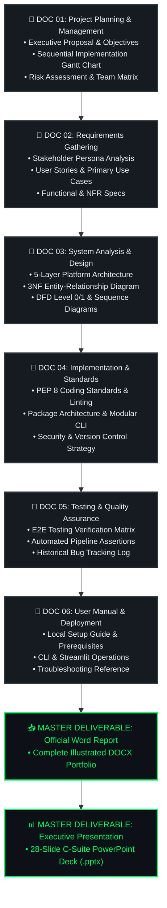

 

&nbsp;
&nbsp;
&nbsp;
&nbsp;
&nbsp;

 &nbsp;

  

<em>"End-to-End Academic Rigor Meets Enterprise Engineering Excellence"</em> 
<strong>— Team X · Data Analysis & Engineering Track</strong>

  

---

### 🏆 Executive Project Specification Grid

<table width="100%" align="center">
  <tr>
    <td align="center" width="33%">
       
      📚 <strong>Academic Suite</strong> 
      <h2 style="color: #00FF66;">6 Master Docs</h2>
      <em>Comprehensive & Audited</em>
        
    </td>
    <td align="center" width="33%">
       
      🏙️ <strong>Audited Properties</strong> 
      <h2 style="color: #00E5FF;">11,638 Buildings</h2>
      <em>NYC Open Data Portal (LL84)</em>
        
    </td>
    <td align="center" width="33%">
       
      ⚠️ <strong>Statutory Liability</strong> 
      <h2 style="color: #FF4B4B;">$2.83 Billion / yr</h2>
      <em>NYC Local Law 97 Penalty</em>
        
    </td>
  </tr>
  <tr>
    <td align="center" width="33%">
       
      🤖 <strong>Predictive AI Accuracy</strong> 
      <h2>R² = 81.65%</h2>
      <em>Random Forest Regressor</em>
        
    </td>
    <td align="center" width="33%">
       
      ⚡ <strong>Surgical Phase Payback</strong> 
      <h2>8 Days</h2>
      <em>Immediate Cash-Flow Positive</em>
        
    </td>
    <td align="center" width="33%">
       
      💬 <strong>AI Executive Co-Pilot</strong> 
      <h2>Gemini 2.5 + Local</h2>
      <em>Live Dual-Engine Chatbot</em>
        
    </td>
  </tr>
</table>

---

## 💬 Executive C-Suite AI Co-Pilot & Chatbot (Google Gemini 2.5 Flash + Local Engine)

Across all documentation files and live interactive tools, our system features an embedded **AI Executive Chatbot & Dual-Engine Visualizer**:
- **Live AI Mode (`Gemini 2.5 Flash`):** Generative strategic insights and on-the-fly custom Plotly chart generation with automatic multi-model fallback (`Gemini 2.5 -> 2.0 -> 1.5 Flash`).
- **Local Quantitative & Interactive Charting Engine:** Guaranteed resilience during offline mode or free-tier rate limits (`HTTP 429`), automatically rendering interactive Plotly charts and dataset audits directly from `sample_nyc_energy.xlsx`.

---

## 🗺️ Documentation Lifecycle & Traceability Flow

Our academic suite is designed with **full bidirectional traceability**: every business objective maps to functional requirements, database schemas, code modules, and verification test cases.

---

### 🏢 Visual Business Intelligence Layer (`PowerBI/` & `Tableau/`)
In addition to the 16-sheet Excel financial engineering model and live Streamlit web app, the project suite embeds **Dual-Engine Enterprise Visual BI Workbooks** (`Pillar 6`):
- **Power BI Executive BI Portal (`NYC_Carbon_Heist_Mitigation_PowerBI_Dashboard.pbix`):** A standalone 3-page interactive dashboard (`Factors Affecting GHG Emissions` ➔ `Asset Granularity & Construction Era` ➔ `Carbon Cost & Savings Analysis Waterfall`) featuring Dark Royal Navy styling (`#0F172A`), custom DAX measures, and synchronized slicers for `Borough`, `Property Type`, and `Decade Built`.
- **Tableau Executive BI Portal (`NYC_Carbon_Heist_Mitigation_Tableau_Dashboard.twbx`):** A packaged 3-page progressive visual analytics dashboard with Royal Navy & Gold aesthetics (`#0D1321` / `#FFD700`) and mobile-scannable QR bridging directly to our live Tableau Public portal.

---

## 📚 Official Deliverables Master Index

| ID | Specification Section | Key Topics & Engineering Scope | Verification Status | Clickable Document Link |
| :---: | :--- | :--- | :---: | :---: |
| **01** | **Project&nbsp;Planning&nbsp;&&nbsp;Management** | Executive proposal, sequential Gantt roadmap, project scope, team operational roles, and risk assessment KPI matrix. | **🟢&nbsp;Verified** | [📖&nbsp;Open&nbsp;Doc&nbsp;01](./01_Project_Proposal_and_Planning.md) |
| **02** | **Requirements&nbsp;Gathering** | Stakeholder persona matrix, comprehensive user stories (`US-01` to `US-05`), operational use cases, functional requirements (`FR-01` to `FR-07`), and NFRs. | **🟢&nbsp;Verified** | [📖&nbsp;Open&nbsp;Doc&nbsp;02](./02_Requirements_and_Stakeholders.md) |
| **03** | **System&nbsp;Analysis&nbsp;&&nbsp;Design** | 5-Layer architectural blueprint, normalized 3NF ER Diagram (`PROPERTIES` to `LL97_PENALTIES`), DFD Level 0/1, and 5-Tab sequence workflows. | **🟢&nbsp;Verified** | [📖&nbsp;Open&nbsp;Doc&nbsp;03](./03_System_Analysis_and_Design.md) |
| **04** | **Implementation&nbsp;&&nbsp;Standards** | Strict PEP 8 coding standards, package folder structure, secure data handling, Dual-Engine exception shielding, and Git branching workflow. | **🟢&nbsp;Verified** | [📖&nbsp;Open&nbsp;Doc&nbsp;04](./04_Implementation_and_Coding_Standards.md) |
| **05** | **Testing&nbsp;&&nbsp;Quality&nbsp;Assurance** | Full end-to-end verification test matrix (`TC-01` to `TC-09`), automated data pipeline hygiene assertions, and bug resolution log. | **🟢&nbsp;Verified** | [📖&nbsp;Open&nbsp;Doc&nbsp;05](./05_Testing_and_Quality_Assurance.md) |
| **06** | **User&nbsp;Manual&nbsp;&&nbsp;Deployment** | Complete local setup instructions, Python package requirements, CLI playground execution, and Streamlit dashboard user manual. | **🟢&nbsp;Verified** | [📖&nbsp;Open&nbsp;Doc&nbsp;06](./06_User_Manual_and_Deployment.md) |
| **DOCX** | **Official Word Documentation** | Fully formatted academic and technical documentation file ready for printing, submission, and executive presentation. | **🟢&nbsp;Verified** | [📥&nbsp;Download&nbsp;Word&nbsp;Doc](./Carbon_Heist_Mitigation_Documentation.docx) |
| **PPTX** | **Official Executive Presentation** | 28-Slide C-Suite PowerPoint presentation deck outlining financial projections, treemaps, and engineering playbooks. | **🟢&nbsp;Verified** | [📊&nbsp;Download&nbsp;Presentation](./NYC_Carbon_Heist_Mitigation_Presentation.pptx) |

---

## 🏛️ Statutory Reference Formulas

Across all academic documentation files, regulatory penalty exposure and capital payback horizons are evaluated using:

<table width="100%" align="center">
  <tr>
    <td width="50%" style="padding: 16px;">
      <h3>⚖️ 1. NYC Local Law 97 Statutory Fine Formula</h3>
      

        <strong>Penalty [in USD] = Total Emissions (MT CO₂e) × 268</strong>
      

      <em>Where <strong>268 USD</strong> is the mandatory Local Law 97 statutory fine rate evaluated per metric ton of total greenhouse gas emissions across our non-compliant portfolio of <strong>11,638</strong> buildings.</em>
    </td>
    <td width="50%" style="padding: 16px;">
      <h3>📈 2. CAPEX Retrofit Payback Formula</h3>
      

        <strong>Payback Period (Years) = CAPEX [in USD] ÷ (Annual Utility Savings [in USD] + Avoided LL97 Fines [in USD])</strong>
      

      <em>Measures capital recovery speed combining annual utility cost reductions and statutory penalty avoidance.</em>
    </td>
  </tr>
</table>

---

<strong>End-to-End Academic & Engineering Excellence</strong> 
<em>Team X · Carbon Heist Mitigation Platform · 2026</em>

  

