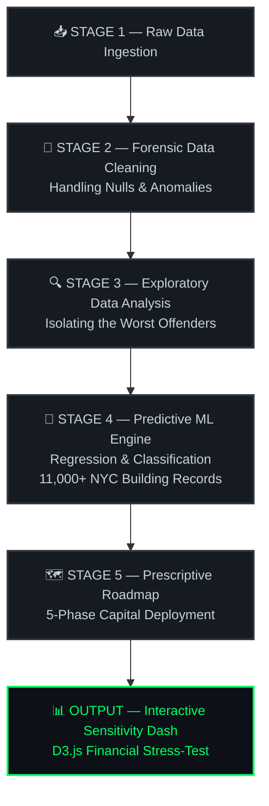

<div align="center">


<br/>

<a href="https://python.org"></a>&nbsp;
<a href="https://scikit-learn.org"></a>&nbsp;
<a href="#-interactive-sensitivity-dashboard"></a>&nbsp;
<a href="LICENSE"></a>&nbsp;


<br/><br/>

<em>"Compliance is a cost. Leadership is an asset."</em><br/>
<strong>— Team X</strong>

<br/><br/>

<hr/>

<h3>🏙️ The Mission</h3>

<p><strong>NYC Local Law 97 (LL97)</strong> exposed our 2.06 billion sq. ft. real estate portfolio to an annual carbon penalty of:</p>

<br/>

<table>
  <tr>
    <td align="center">
      <br/>
      <strong>⚠️ &nbsp; ANNUAL LIABILITY EXPOSURE</strong>
      <br/><br/>
      <h1>$ 2,880,000,000</h1>
      <br/>
      <em>2.06 Billion Sq. Ft. Portfolio</em>
      <br/><br/>
    </td>
  </tr>
</table>

<br/>

<p>We built an end-to-end data science platform to forensic-audit the portfolio, identify the <strong>"True Culprits,"</strong> and execute a high-yield, self-funding carbon mitigation roadmap — turning a <strong>$2.88B liability into a strategic asset.</strong></p>

<hr/>
</div>

## 📋 Table of Contents

- [🎯 Key Results at a Glance](#-key-results-at-a-glance)
- [🛠️ End-to-End Project Workflow](#️-end-to-end-project-workflow)
- [📂 Repository Structure](#-repository-structure)
- [🤖 The ML Insights Engine](#-the-ml-insights-engine)
- [📊 Interactive Sensitivity Dashboard](#-interactive-sensitivity-dashboard)
- [🗺️ The 5-Scenario Decarbonization Pipeline](#️-the-5-scenario-decarbonization-pipeline)
- [🚀 Quick Start](#-quick-start)
- [👥 The Heist Crew — Team X](#-the-heist-crew--team-x)
- [⚖️ License](#️-license)

---

## 🎯 Key Results at a Glance

| Metric | Value |
|:---|:---:|
| 🏢 Portfolio Size | **2.06 Billion Sq. Ft.** |
| 💰 Liability Neutralized | **$2.88 Billion / yr** |
| 🏗️ Buildings Analyzed | **11,000+** |
| 📉 Best-Case Payback | **8 Days (Surgical Strike)** |
| 📈 Total Annual Savings (Blended) | **$702 Million** |
| ⏱️ Blended Portfolio Payback | **6.41 Years** |

---

## 🛠️ End-to-End Project Workflow

Our platform implements a disciplined, multi-stage data science and engineering lifecycle:



---

## 📂 Repository Structure

```
decarbonization-heist/
│
├── 📁 models/
│   ├── 🐍 train_ll97_model.py      # ML pipeline: preprocessing, feature engineering & training
│   └── 🐍 ll97_playground.py       # Interactive CLI audit tool for individual assets
│
├── 📁 data/
│   ├── 🐍 clean_data_pipeline.py   # Dataset wrangling, cleaning & null-value imputation
│   └── 📊 sample_nyc_energy.csv    # Anonymized slice of 11,000+ NYC building energy records
│
├── 📁 app/
│   └── 🌐 sensitivity_dash.html    # Interactive Sensitivity Analysis dashboard (D3.js)
│
├── 📄 requirements.txt             # Python dependencies
└── 📄 README.md                    # You are here
```

---

## 🤖 The ML Insights Engine

Instead of throwing unhedged capital at energy-efficient properties, we engineered a **Predictive ML Regression & Classification Pipeline** using `scikit-learn` to process municipal energy records of **11,000+ NYC buildings**.

<details>
<summary><strong>💡 Key Discoveries from Feature Importance Modeling</strong></summary>

1. **Gross Floor Area (GFA)** and **Year Built** are the strongest predictive signals for carbon footprint scaling — outperforming neighborhood, property type, and utility source in model importance ranking.

2. **Pre-war masonry skyscrapers (1930s era) are not write-offs.** When properly audited via our Waste-heat Energy Transfer (WET) system model, they present the *highest latent return on capital* in the entire portfolio.

3. **Energy Star Scores are a lagging indicator.** Assets with mid-range scores (50–65) hold disproportionate untapped reduction potential vs. their stated compliance risk.

</details>

<details>
<summary><strong>🖥️ CLI Audit Playground — Console Demo</strong></summary>

```
C:\Users\TeamX\Desktop> python ll97_playground.py
╔════════════════════════════════════════════════════╗
║       LL97 DATA-DRIVEN FORENSIC AUDIT ENGINE       ║
║       Trained on 11,000+ NYC Building Records      ║
╚════════════════════════════════════════════════════╝
[*] Training Phase: Analyzing patterns in 11,247 records...
[✓] Model Ready.
━━━━━━━━━━━━━━━━━━━━━━━━━━━━━━━━━━━━━━━━━━━━━━━━━━━━
>>> ASSET INPUT
  Year Built          [or 'exit']: 1934
  GFA (sq ft)                    : 5,000,000
  Energy Star Score (1-100)      : 55
  Borough                        : Bronx
  Property Type                  : Multifamily Housing
━━━━━━━━━━━━━━━━━━━━━━━━━━━━━━━━━━━━━━━━━━━━━━━━━━━━
>>> STRATEGIC AUDIT: MULTIFAMILY HOUSING — BRONX
  [PREDICTED EMISSIONS]   31,446.0 Metric Tons CO2e / yr
  [CARBON LIABILITY]      $1.69 / sqft  (Total Exposure)
  [PEER COMPARISON]       -30.4% vs. Portfolio Average
  [VERDICT]  ⚡ HIGH OPPORTUNITY — WET System Candidate
```

</details>

---

## 📊 Interactive Sensitivity Dashboard

To stress-test our carbon mitigation strategy against severe economic and regulatory shifts, we built an **Interactive Sensitivity Analysis Dashboard** in D3.js.

**Core Financial Formula:**

$$
\text{Payback Period} = \frac{\text{CAPEX}}{\text{Annual Savings (Utility Savings + Avoided Fines)}}
$$

<details>
<summary><strong>📐 Dashboard Features</strong></summary>

| Feature | Description |
|:---|:---|
| 📏 **Log Scale Toggle** | Visualize the Surgical Strike ($31.64/sqft return) alongside billion-dollar capital projects on the same axis |
| 🎛️ **Sensitivity Sliders** | Adjust carbon price, discount rate, and utility escalation assumptions in real-time |
| ⚠️ **Phase 2 Impact Proof** | Bypassing BMS Systems & Tuning degrades overall payback from **7.15 yrs → 12.3 yrs** — empirically proven |
| 💹 **Waterfall View** | Visualize the self-funding cascade: early-phase savings unlock later-phase CAPEX |

</details>

---

## 🗺️ The 5-Scenario Decarbonization Pipeline

Our capital deployment follows a strict **self-funding pipeline**: rapid-payback early interventions generate the liquid reserves needed to fund deep structural retrofits.

| # | Scenario | GFA | CAPEX | Utility Savings | Avoided Fines | Total Savings | Payback |
|:---:|:---|:---:|:---:|:---:|:---:|:---:|:---:|
| 🟢 | **Surgical Strike** | 20M sqft | $500K | $2.19M | $18.50M | $20.69M | **8 Days** |
| 🔵 | **Smart Scale** *(1960s)* | 400M sqft | $2.00B | $100.00M | $236.01M | $336.01M | **5.95 yrs** |
| 🟡 | **WET System** *(1930s)* | 20M sqft | $1.50B | $40.00M | $82.89M | $122.89M | **12.21 yrs** |
| 🔴 | **Full Electrification** *(1980s+)* | 100M sqft | $1.00B | $60.00M | $162.64M | $222.64M | **4.49 yrs** |
| 🏆 | **Total Portfolio** | **540M sqft** | **$4.50B** | **$202.19M** | **$500.04M** | **$702.23M** | **6.41 yrs** |

> 💡 **Self-Funding Logic:** The Surgical Strike (8-day payback) generates immediate cash flow that seeds the Smart Scale phase, which in turn funds the deeper WET and Electrification infrastructure — making the entire $4.5B roadmap capital-efficient.

---

## 🚀 Quick Start

**Prerequisites:** Python 3.9+, pip

```bash
# 1. Clone the repository
git clone https://github.com/ahmedadelamin/decarbonization-heist.git
cd decarbonization-heist

# 2. Install dependencies
pip install -r requirements.txt

# 3. (Optional) Train / retrain the ML model
python models/train_ll97_model.py

# 4. Launch the interactive forensic audit tool
python models/ll97_playground.py
```

Open `app/sensitivity_dash.html` directly in any modern browser — no server required.

---

## 👥 The Heist Crew — Team X

*Five specialists. One mission. Zero excuses.*

| Role | Operative | Domain |
|:---:|:---|:---|
| 🧠 **The Mastermind** | **Ahmed Adel Amin** | ML Pipeline Architecture · Forensic Cleaning · Feature Engineering |
| ⚙️ **The Engineer** | **Ledia Sobhy** | WET System Design · Heat Pump Integration · HVAC Thermal Modeling |
| 📋 **The Regulator** | **Huda Amr** | LL97 Policy Audit · Portfolio Emissions Mapping · Environmental Strategy |
| 💹 **The Strategist** | **Hagar Hussein** | Sensitivity Stress-Testing · Capital Optimization · Payback & ROI Modeling |
| 🔍 **The Analyst** | **Abeer Adel** | Data Analysis · Portfolio Benchmarking · Insights Reporting |

---

## ⚖️ License

This project is licensed under the **MIT License** — see the [LICENSE](LICENSE) file for details.

---

<div align="center">


<em>Securing the Skyline — One Data Point at a Time</em><br/>
<strong>Team X · NYC · 2024</strong>

<br/><br/>

<a href="https://github.com/ahmedadelamin/decarbonization-heist">
  
</a>

</div>
