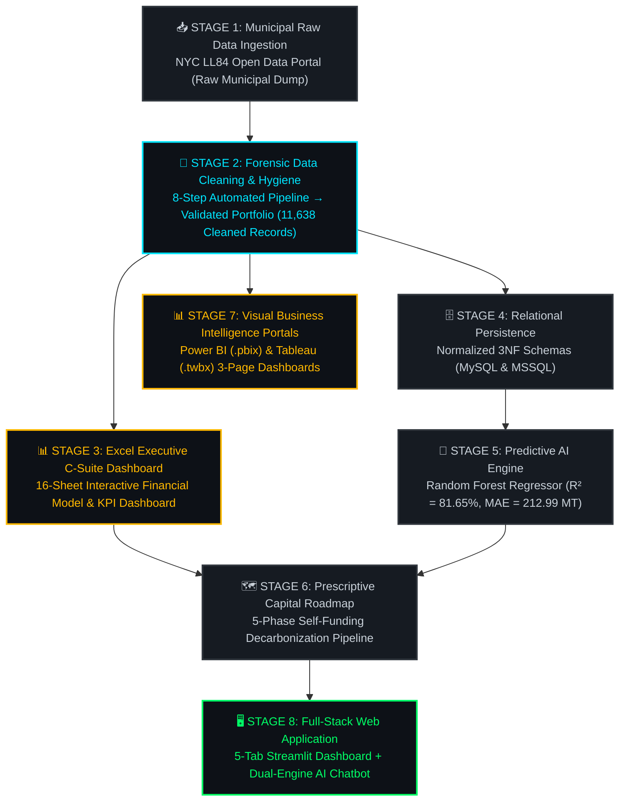

<a id="top"></a>
<div align="center">


<br/>

<a href="https://carbon-heist-mitigation.streamlit.app/"></a>&nbsp;
<a href="PowerBI/"></a>&nbsp;
<a href="https://public.tableau.com/app/profile/ahmed.adel.amin/viz/NYC_Carbon_Heist_Mitigation_Tableau_Dashboard/DecarbonizationRoadmap"></a>&nbsp;
<a href="https://python.org"></a>&nbsp;
<a href="https://scikit-learn.org"></a>&nbsp;
<a href="https://carbon-heist-mitigation.streamlit.app/"></a>&nbsp;
<a href="https://carbon-heist-mitigation.streamlit.app/"></a>&nbsp;
<a href="database/"></a>&nbsp;
<a href="LICENSE"></a>

<br/><br/>

<em>"Compliance is a cost. Executive leadership is an asset."</em><br/>
<strong>— Team X · NYC Local Law 97 Intelligence Platform</strong>

<br/><br/>

</div>

---

<div align="center">

### 🏆 Executive Portfolio Performance Dashboard

<table width="100%" align="center">
  <tr>
    <td align="center" width="33%">
      <br/>
      🏢 <strong>Portfolio Scale</strong><br/>
      <h2 style="color: #00FF66;">2.06 Billion Sq. Ft.</h2>
      <em>11,638 NYC Properties</em>
      <br/><br/>
    </td>
    <td align="center" width="33%">
      <br/>
      ⚠️ <strong>Annual LL97 Liability</strong><br/>
      <h2 style="color: #FF4B4B;">$2.83 Billion / yr</h2>
      <em>Statutory Fine ($268 / MT)</em>
      <br/><br/>
    </td>
    <td align="center" width="33%">
      <br/>
      💰 <strong>Recurring Annual Savings</strong><br/>
      <h2 style="color: #00E5FF;">$656.63 Million / yr</h2>
      <em>Annual Fine & Utility Cost Avoidance</em>
      <br/><br/>
    </td>
  </tr>
  <tr>
    <td align="center" width="33%">
      <br/>
      🤖 <strong>Predictive AI Accuracy</strong><br/>
      <h2>R² = 81.65%</h2>
      <em>Random Forest Regressor</em>
      <br/><br/>
    </td>
    <td align="center" width="33%">
      <br/>
      ⚡ <strong>Surgical Phase Payback</strong><br/>
      <h2>8 Days</h2>
      <em>Immediate Cash-Flow Positive</em>
      <br/><br/>
    </td>
    <td align="center" width="33%">
      <br/>
      💬 <strong>AI Executive Co-Pilot</strong><br/>
      <h2>Gemini 2.5 + Local</h2>
      <em>Live Dual-Engine Chatbot</em>
      <br/><br/>
    </td>
  </tr>
</table>
</div>

---

## 🏙️ The Mission & Challenge

New York City's **Local Law 97 (LL97)** imposes strict carbon emission caps on buildings exceeding 50,000 sq. ft. Starting in 2024—and escalating dramatically in 2030—properties exceeding statutory thresholds face mandatory annual fines of **$268 per metric ton of CO₂e**.

Across our **2.06 Billion Sq. Ft. real estate portfolio (11,638 validated records)**, unmitigated exposure amounts to **$2.83 Billion annually**—effectively a recurring carbon heist on net operating income (NOI).

We built an end-to-end data engineering, machine learning, and interactive financial decision-support platform to forensic-audit the portfolio, isolate the **"True Culprits,"** and deploy a self-funding 5-phase decarbonization roadmap that transforms a regulatory liability into a high-yield strategic asset.

---

## 📚 Official Project Documentation Suite

All academic and technical deliverables for the **Data Analysis & Engineering Track** are available in the [`Project Documentations/`](./Project%20Documentations/) directory:

| Doc ID | Deliverable Title | Core Focus & Highlights | Status | Read Link |
| :---: | :--- | :--- | :---: | :---: |
| **01** | **Project Planning & Management** | Project Proposal, Sequential Gantt Roadmap, Team Roles, Risk Matrix | 🟢 Complete | [📖 Doc 01](./Project%20Documentations/01_Project_Proposal_and_Planning.md) |
| **02** | **Requirements Gathering** | Stakeholder Persona Matrix, User Stories, Functional & NFR Specs | 🟢 Complete | [📖 Doc 02](./Project%20Documentations/02_Requirements_and_Stakeholders.md) |
| **03** | **System Analysis & Design** | 5-Layer Architecture, Normalized ERD, DFD Levels, Sequence Diagrams | 🟢 Complete | [📖 Doc 03](./Project%20Documentations/03_System_Analysis_and_Design.md) |
| **04** | **Implementation & Standards** | PEP 8 Coding Guidelines, Modular Python Packages, Security Audits | 🟢 Complete | [📖 Doc 04](./Project%20Documentations/04_Implementation_and_Coding_Standards.md) |
| **05** | **Testing & Quality Assurance** | End-to-End Verification Matrix, Pipeline Assertions, Bug Tracking | 🟢 Complete | [📖 Doc 05](./Project%20Documentations/05_Testing_and_Quality_Assurance.md) |
| **06** | **User Manual & Deployment** | Step-by-Step Installation Guide, CLI Operations, Troubleshooting | 🟢 Complete | [📖 Doc 06](./Project%20Documentations/06_User_Manual_and_Deployment.md) |
| **DOCX** | **Official Word Documentation** | Comprehensive formatted academic report with executive KPI cards | 🟢 Complete | [📥 Word File](./Project%20Documentations/Carbon_Heist_Mitigation_Documentation.docx) |
| **PPTX** | **Official Executive Presentation** | 28-Slide C-Suite PowerPoint Presentation deck with financial charts & regional treemaps | 🟢 Complete | [📊 Presentation Deck](./Project%20Documentations/NYC_Carbon_Heist_Mitigation_Presentation.pptx) |

---

## 🛠️ End-to-End Data Science & Engineering Architecture


```mermaid
flowchart TD
    A["📥 STAGE 1: Municipal Raw Data Ingestion\nNYC LL84 Open Data Portal (Raw Municipal Dump)"]:::stage --> B["🧹 STAGE 2: Forensic Data Cleaning & Hygiene\n8-Step Automated Pipeline → Validated Portfolio (11,638 Cleaned Records)"]:::clean
    B --> EX["📊 STAGE 3: Excel Executive C-Suite Dashboard\n16-Sheet Interactive Financial Model & KPI Dashboard"]:::excel
    B --> C["🗄️ STAGE 4: Relational Persistence\nNormalized 3NF Schemas (MySQL & MSSQL)"]:::stage
    C --> D["🤖 STAGE 5: Predictive AI Engine\nRandom Forest Regressor (R² = 81.65%, MAE = 212.99 MT)"]:::stage
    EX --> E["🗺️ STAGE 6: Prescriptive Capital Roadmap\n5-Phase Self-Funding Decarbonization Pipeline"]:::stage
    B --> BI["📊 STAGE 7: Visual Business Intelligence Portals\nPower BI (.pbix) & Tableau (.twbx) 3-Page Dashboards"]:::excel
    D --> E
    E --> F["🖥️ STAGE 8: Full-Stack Web Application\n5-Tab Streamlit Dashboard + Dual-Engine AI Chatbot"]:::output

    classDef stage fill:#161B22,stroke:#30363D,stroke-width:2px,color:#C9D1D9,font-size:14px
    classDef clean fill:#0D1117,stroke:#00E5FF,stroke-width:2px,color:#00E5FF,font-size:14px
    classDef excel fill:#0D1117,stroke:#FFB800,stroke-width:2px,color:#FFB800,font-size:14px
    classDef output fill:#0D1117,stroke:#00FF66,stroke-width:2px,color:#00FF66,font-size:14px
```

---

## 📂 Complete Repository Tree

```text
carbon-heist-mitigation/
│
├── 📁 Project Documentations/         # Official 6-Part Technical & Academic Documentation Suite
│   ├── 📄 01_Project_Proposal_and_Planning.md
│   ├── 📄 02_Requirements_and_Stakeholders.md
│   ├── 📄 03_System_Analysis_and_Design.md
│   ├── 📄 04_Implementation_and_Coding_Standards.md
│   ├── 📄 05_Testing_and_Quality_Assurance.md
│   ├── 📄 06_User_Manual_and_Deployment.md
│   ├── 📄 Carbon_Heist_Mitigation_Documentation.docx
│   └── 📊 NYC_Carbon_Heist_Mitigation_Presentation.pptx # 28-Slide C-Suite Executive Presentation
│
├── 📁 PowerBI/                     # 3-Page Executive C-Suite BI & Visual Analytics Portal
│   ├── 📄 README.md                # Comprehensive guide to DAX formulas & 3-page dashboards
│   └── 📊 NYC_Carbon_Heist_Mitigation_PowerBI_Dashboard.pbix # Packaged Power BI Desktop workbook
│
├── 📁 Tableau/                     # 3-Page Executive C-Suite BI & Visual Analytics Portal
│   ├── 📄 README.md                # Comprehensive guide to calculated fields & dashboards
│   └── 📊 NYC_Carbon_Heist_Mitigation_Tableau_Dashboard.twbx # Packaged workbook with bundled master dataset
│
├── 📁 Excel Project/               # Domain Reference & Financial Engineering Models
│   ├── 📄 README.md                # Guide to all 16 financial engineering sheets
│   └── 📊 Co2 Project.xlsx         # 16-sheet comprehensive LL97 compliance & retrofit workbook
│
├── 📁 application/                 # Presentation & UI Layer
│   ├── 📄 README.md                # Dashboard setup & usage instructions
│   ├── 🐍 app.py                   # Streamlit & Plotly Interactive Executive Dashboard
│   ├── 📊 input.xlsx               # Clean building benchmarking records for dashboard UI
│   └── 📊 results.csv              # Exported simulation analytics
│
├── 📁 models/                      # AI & Machine Learning Layer (R² = 81.65%)
│   ├── 📄 README.md                # ML architecture & training documentation
│   ├── 🐍 train_ll97_model.py      # Automated model training pipeline
│   ├── 🐍 ll97_playground.py       # Interactive CLI simulation audit tool
│   ├── 💾 ll97_model.joblib        # Serialized Random Forest Regressor
│   └── 💾 ll97_encoders.joblib     # Serialized categorical feature encoders
│
├── 📁 data/                        # Data Engineering & ETL Pipeline
│   ├── 📄 README.md                # 8-step cleaning pipeline overview
│   ├── 🐍 Clean_Data_Pipeline.py   # Automated cleaning & null imputation script
│   ├── 📊 sample_nyc_energy.xlsx   # Validated dataset (11,638 compliant NYC buildings)
│   └── 📄 LL97_Data_Cleaning_Report.pdf # Automated PDF audit report
│
├── 📁 database/                    # Relational Database & Persistence Layer (3NF)
│   ├── 📄 README.md                # Database design & schema guide
│   ├── 📜 carbon_heist_schema_mysql.sql # SQL DDL for MySQL & PostgreSQL
│   ├── 📜 carbon_heist_schema_mssql.sql # Dedicated T-SQL DDL for Microsoft SQL Server
│   ├── 📊 NYC_Energy_CO2_Tables_V2.xlsx # Table data dictionary & relational mappings
│   └── 🗺️ NYC_Energy_Chen_ERD.drawio  # Editable Chen-style ER Diagram
│
├── 📄 requirements.txt             # Python environment dependencies
├── ⚖️ LICENSE                      # MIT License
└── 📄 README.md                    # Project Executive Overview (You are here)
```

---

## 🌐 Pillar 5: Streamlit Full-Stack Web Application & Dual-Engine AI Chatbot

> [!TIP]
> ### 🌐 **[Click Here to Launch the Live Interactive C-Suite Dashboard Online](https://carbon-heist-mitigation.streamlit.app/)**
> Explore all 11,638 NYC properties, interactive real-time mitigation sliders, Random Forest AI compliance predictions, and 5-playbook CAPEX financial modeling directly in your browser without local setup.

The live Streamlit application (`application/app.py`) features an integrated **Executive C-Suite AI Co-Pilot & Chatbot** trained on our complete 11,638-property forensic dataset:

- **🧠 Live Generative AI Mode (Google Gemini 2.5 Flash):** Connect any Google Gemini API key directly in the UI header to enable live C-Suite strategic reasoning. The AI parses any natural-language prompt, computes executive metrics, and dynamically generates custom interactive Plotly visualizations on the fly. Built-in **Multi-Model Auto-Fallback (`Gemini 2.5 -> 2.0 -> 1.5 Flash`)** and exponential backoff retry guarantee high resilience.
- **⚡ Local Quantitative & Charting Engine (Offline/Rate-Limit Safe):** Even without an API key or during API rate limits (`HTTP 429`), our embedded local dataset engine parses natural-language queries (`"top 10 buildings"`, `"multifamily housing"`, `"boroughs"`, `"capex breakdown"`, `"payback horizon"`) and instantly renders both quantitative C-Suite text analysis and interactive Plotly charts directly from our audited `sample_nyc_energy.xlsx` database.

---

## 📊 Pillar 6: Enterprise Visual Business Intelligence Portals (`PowerBI/` & `Tableau/`)

In addition to our full-stack Streamlit application and 16-sheet Excel financial model, the platform embeds **Dual-Engine Enterprise Visual BI Workbooks** designed for boardroom presentations and executive decision-making:
- **📊 Power BI Executive BI Portal (`PowerBI/NYC_Carbon_Heist_Mitigation_PowerBI_Dashboard.pbix`):** A standalone 3-page interactive dashboard (`Factors Affecting GHG Emissions` ➔ `Asset Granularity & Construction Era` ➔ `Carbon Cost & Savings Analysis Waterfall`) featuring Dark Royal Navy styling (`#0F172A`), custom DAX measures, and synchronized slicers for `Borough`, `Property Type`, and `Decade Built`.
- **📈 Tableau Executive C-Suite Portal (`Tableau/NYC_Carbon_Heist_Mitigation_Tableau_Dashboard.twbx`):** A packaged 3-page progressive visual analytics dashboard with Royal Navy & Gold aesthetics and mobile-scannable QR bridging directly to our live Tableau Public portal.

---

## 🖥️ Live Forensic Audit Showcase (CLI Engine Output)

Our interactive simulation playground (`models/ll97_playground.py`) provides asset managers and MEP engineers with instant forensic carbon audits and scenario stress-testing:

```text
╔══════════════════════════════════════════════════════════════════════╗
║             NYC LL97 DATA-DRIVEN FORENSIC AUDIT ENGINE               ║
║            Trained on 11,638 Compliant Building Records              ║
╚══════════════════════════════════════════════════════════════════════╝
[*] Training Phase: Loading Random Forest Regressor (R² = 81.65%)...
[✓] Model Ready & Verified.
━━━━━━━━━━━━━━━━━━━━━━━━━━━━━━━━━━━━━━━━━━━━━━━━━━━━━━━━━━━━━━━━━━━━━━
>>> ASSET SPECIFICATION INPUT
  Year Built                     : 1934
  Gross Floor Area (GFA)         : 5,000,000 sq. ft.
  ENERGY STAR Score (1-100)      : 55
  Borough                        : Manhattan
  Primary Property Type          : Commercial Office / Retail
━━━━━━━━━━━━━━━━━━━━━━━━━━━━━━━━━━━━━━━━━━━━━━━━━━━━━━━━━━━━━━━━━━━━━━
>>> STRATEGIC AUDIT VERDICT: COMMERCIAL TOWER — MANHATTAN
  [PREDICTED GHG EMISSIONS]    31,446.0 Metric Tons CO₂e / yr
  [ANNUAL STATUTORY PENALTY]   $8,427,528.00 / yr  ($1.69 / sq. ft.)
  [PORTFOLIO BENCHMARKING]     -30.4% Carbon Intensity vs. Peer Average
  [OPTIMAL RETROFIT VERDICT]   ⚡ HIGH OPPORTUNITY — WET System & BMS Candidate
━━━━━━━━━━━━━━━━━━━━━━━━━━━━━━━━━━━━━━━━━━━━━━━━━━━━━━━━━━━━━━━━━━━━━━
```

<details>
<summary><strong>💡 Strategic Discoveries from Feature Importance Modeling (Click to Expand)</strong></summary>

1. **Gross Floor Area (GFA) & Year Built Dominate Liability:**  
   Physical asset dimensions and structural age are the two strongest predictors of carbon liability—outranking borough geography and primary utility feed type.
2. **1930s Pre-War Skyscrapers Offer Maximum ROI:**  
   Counter-intuitively, pre-war masonry properties hold the highest latent thermal efficiency gains when retrofitted with Waste-heat Energy Transfer (WET) recovery systems.
3. **ENERGY STAR Scores are a Lagging Indicator:**  
   Properties with mid-tier ENERGY STAR scores (50–65) yield disproportionately larger fine avoidance per CAPEX dollar invested compared to high-tier properties.

</details>

---

## 🏛️ Statutory Reference Formulas

Across all academic documentation files, regulatory penalty exposure and capital payback horizons are evaluated using:

<table width="100%" align="center">
  <tr>
    <td width="50%" style="padding: 16px;">
      <h3>⚖️ 1. NYC Local Law 97 Statutory Fine Formula</h3>
      <p>
        <strong>Penalty [in USD] = Total Emissions (MT CO₂e) × 268</strong>
      </p>
      <em>Where <strong>268 USD</strong> is the mandatory Local Law 97 statutory fine rate evaluated per metric ton of total greenhouse gas emissions across our non-compliant portfolio of <strong>11,638</strong> buildings.</em>
    </td>
    <td width="50%" style="padding: 16px;">
      <h3>📈 2. CAPEX Retrofit Payback Formula</h3>
      <p>
        <strong>Payback Period (Years) = CAPEX [in USD] ÷ (Annual Utility Savings [in USD] + Avoided LL97 Fines [in USD])</strong>
      </p>
      <em>Measures capital recovery speed combining annual utility cost reductions and statutory penalty avoidance.</em>
    </td>
  </tr>
</table>

---

## 🗺️ The 5-Scenario Self-Funding Decarbonization Pipeline

Our capital deployment follows a strict **self-funding cascade**: rapid-payback early interventions generate immediate operational cash flows that fund deeper structural retrofits without over-leveraging portfolio assets.

> [!IMPORTANT]
> ### **All Savings Figures Represent Recurring Annual Savings ($ / Year)**
> Every savings metric reported across the dashboard and tables represents **recurring annual statutory fine avoidance and operational utility savings ($ / yr)** generated recursively every year following retrofit completion.

| Phase & Strategy | Target Scope | Initial CAPEX ($) | Annual OPEX ($/yr) | Gross Savings ($/yr) | Net Benefit ($/yr) | Payback Period | Strategic Execution & OPEX Scope |
| :--- | :--- | :---: | :---: | :---: | :---: | :---: | :--- |
| **01 · 🟢 Surgical Strike**<br/>*Top 10 Worst Offenders* | **0.07% Area** | **$500 K** | **$45 K / yr** | **$20.59 M / yr** | **$20.55 M / yr** | ⚡ **0.02 Yrs (8 Days)** | Level 2 Energy Audits & low-cost OPEX fixes. OPEX covers quarterly sensor calibrations & BMS scheduling software. |
| **02 · 🔵 Retro-commissioning**<br/>*ENERGY STAR Score < 50* | **Low-Score Bldgs** | **$802.17 M** | **$3.25 M / yr** | **$243.62 M / yr** | **$240.37 M / yr** | ⚡ **3.29 Yrs** | RCx & BMS optimization at $1.50/ft². OPEX covers continuous FDD monitoring software & semi-annual VAV box tuning. |
| **03 · 🟡 1960s Smart Scale**<br/>*1960s Commercial / Multi* | **1960s Archetype** | **$785.24 M** | **$2.80 M / yr** | **$88.03 M / yr** | **$85.23 M / yr** | **8.92 Yrs** | Networked LED, VFD motors & steam trap repairs ($2.50/ft²). OPEX covers preventative VFD maintenance & sensor checks. |
| **04 · 🟠 1930s WET Systems**<br/>*1930s Historic Pre-War* | **Pre-War Masonry** | **$1.50 B** | **$4.50 M / yr** | **$122.39 M / yr** | **$117.89 M / yr** | **12.25 Yrs** | Wastewater Heat Exchangers & 50% PPP grant funding. OPEX covers annual anti-fouling flush protocols & pump servicing. |
| **05 · 🔴 Electrification Push**<br/>*Fuel Oil #4 Boilers* | **High-Risk Oil #4** | **$1.89 B** | **$5.10 M / yr** | **$181.99 M / yr** | **$176.89 M / yr** | **10.38 Yrs** | Electric Heat Pumps conversion ($20/ft²). OPEX covers comprehensive OEM maintenance contracts & thermographic checks. |
| **🏆 TOTAL PORTFOLIO**<br/>*Blended 5-Playbook Strategy* | **Entire Portfolio** | **$4.98 B** | **$15.70 M / yr** | **$656.63 M / yr** | **$640.93 M / yr** | 🎯 **7.58 Yrs Blended** | **Self-Funding Decarbonization Cascade across 11,638 verified NYC LL84/LL97 assets (OPEX = 0.32% of CAPEX).** |

---

## 🚀 Quick Start & Live Application

### 🌐 Option A: Instant Cloud Access (Zero Setup)
Launch the fully deployed **Streamlit C-Suite Interactive Dashboard** directly in your browser:
<br/>
[](https://carbon-heist-mitigation.streamlit.app/)

- **Live URL:** [https://carbon-heist-mitigation.streamlit.app/](https://carbon-heist-mitigation.streamlit.app/)

### 💻 Option B: Local Installation & Execution

### 1. Clone & Setup Environment
```bash
git clone https://github.com/ahmedadelamin/carbon-heist-mitigation.git
cd carbon-heist-mitigation
pip install -r requirements.txt
```

### 2. Execute Automated Data Pipeline
```bash
python data/Clean_Data_Pipeline.py
```

### 3. Train Machine Learning Regressor
```bash
python models/train_ll97_model.py
```

### 4. Launch Executive Streamlit Dashboard
```bash
cd application
streamlit run app.py
```

> **Live Dashboard Access:** Once launched, the interactive web dashboard automatically opens at `http://localhost:8501`.

---

## 👥 The Heist Crew — Team X

*Five data science and engineering specialists. One mission.*

<table width="100%" align="center">
  <tr>
    <th width="28%" align="left">Operational Role</th>
    <th width="25%" align="left">Team Member</th>
    <th width="47%" align="left">Primary Responsibility & Domain</th>
  </tr>
  <tr>
    <td>🧠&nbsp;<strong>Lead&nbsp;Data&nbsp;Scientist</strong></td>
    <td><strong>Ahmed&nbsp;Adel&nbsp;Amin</strong></td>
    <td>ML Regression Pipeline · Feature Engineering · Automated ETL Wrangle</td>
  </tr>
  <tr>
    <td>⚙️&nbsp;<strong>MEP&nbsp;&&nbsp;Thermal&nbsp;Lead</strong></td>
    <td><strong>Ledia&nbsp;Sobhy</strong></td>
    <td>WET System Thermodynamic Design · Heat Pump Modeling</td>
  </tr>
  <tr>
    <td>📋&nbsp;<strong>Regulatory&nbsp;Specialist</strong></td>
    <td><strong>Huda&nbsp;Amr</strong></td>
    <td>NYC Local Law 97 Audit · Portfolio Compliance Strategy</td>
  </tr>
  <tr>
    <td>💹&nbsp;<strong>Financial&nbsp;Strategist</strong></td>
    <td><strong>Hagar&nbsp;Hussein</strong></td>
    <td>CAPEX Payback Modeling · Sensitivity Analysis · Cash Flow Cascade</td>
  </tr>
  <tr>
    <td>🔍&nbsp;<strong>Analytics&nbsp;Specialist</strong></td>
    <td><strong>Abeer&nbsp;Adel</strong></td>
    <td>Peer Benchmarking · KPI Visualizations · Reporting Suite</td>
  </tr>
</table>

---

<div align="center">


<strong>Turning a $2.83B Regulatory Liability into a High-Yield Strategic Asset</strong><br/>
<em>Team X · NYC LL97 Decarbonization Intelligence Platform · 2026</em>

<br/><br/>

[](https://carbon-heist-mitigation.streamlit.app/)&nbsp;
[](#top)&nbsp;
[](https://github.com/ahmedadelamin/carbon-heist-mitigation)&nbsp;
[](./Project%20Documentations/README.md)

</div>
